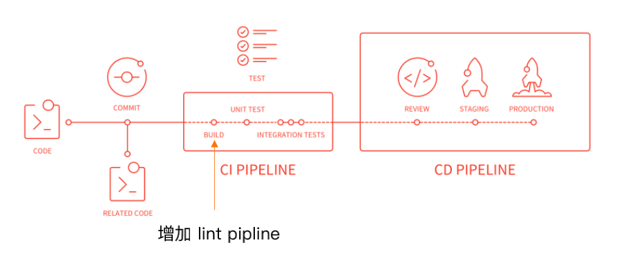

# 学习 webpack

## 带着问题来学习

1. webpack 是做什么的，为什么选择 webpack？
2. webpack 的 entry 和 output 都能配置什么？
3. 常见的 loaders 有哪些？做什么用的？执行顺序？为什么？
4. 常见的 plugins 有哪些？有什么用？
5. webpack 的热更新原理？
6. 文件指纹怎么配置？什么区别？什么是 HTTP 缓存失效？
7. sourceMap 都有哪些配置？应该怎么用？
8. 项目持续集成怎么做？都包含什么哪些检查项，整个过程怎么流转？
9. webpack 构建速度和体积优化策略？
   1. 怎么分析？怎么优化？为什么？
10. splitChunks 怎么配置的？分包策略有哪些？为什么？
11. webpack 的本质？打包原理是什么？tapable 是什么？
12. 如何手写 loader？loader 中怎么处理异步逻辑？
13. 如何手写 plugin？参数有哪些？整个 webpack 的流程是怎样的？涉及哪些 hooks？
14. webpack5 做了哪些优化？
15. 都说 vite bundleless 快？是快在哪里？vite 是如何实现这些支持的？


## 深入问题

1. webpack 是做什么的，为什么选择 webpack？
   1. 为什么需要构建工具？
   2. 前端构建演变之路
   3. 为什么选择 webpack？
2. webpack 的 entry 和 output 都能配置什么？
   1. entry？
   2. output
3. 常用的 loaders 有哪些？做什么用的？多个 loader 执行顺序是怎样的？为什么？
   1. 常用的 loaders
4. 常用的 plugins 有哪些？有什么用？
   1. 常用的 plugins
5. webpack 的热更新原理？
   1. 热更新原理
   2. 更新怎么生效的
6. 文件指纹怎么配置？什么区别？什么是 HTTP 缓存失效？
   1. 文件指纹怎么配置？
   2. 有哪几种配置，区别是什么？
   3. 应该怎么选择？
7. sourceMap 都有哪些配置？应该怎么用？
   1. sourceMap 有哪些配置类型？
   2. 应该怎么选择使用？
8. 项目持续集成怎么做？都包含什么哪些检查项，整个过程怎么流转？
   1. 持续集成的目的是什么？
   2. 我们应该做哪些？
   3. 整个过程是怎样的？
9. webpack 构建速度和体积优化策略？
   1. 怎么分析？
   2. 怎么优化？为什么？
10. splitChunks 怎么配置的？分包策略有哪些？为什么？
    1. 有哪些配置项？
    2. 分包策略有哪些？都解决什么问题？
11. webpack 的本质？打包原理是什么？tapable 是什么？
    1. webpack 的本质？打包原理是什么？
    2. tapable 是什么？
12. 如何手写 loader？loader 中怎么处理异步逻辑？
    1. 如何手写 loader？
    2. 如何在 loader中处理异步逻辑？
13. 如何手写 plugin？参数有哪些？整个 webpack 的流程是怎样的？涉及哪些 hooks？
    1. 如何手写 plugin？
    2. plugin 中有哪些可用参数？
    3. webpack 的大体流程是怎样的？
    4. 流程中常见的 hooks 的有哪些？
14. webpack5 做了哪些优化？
    1. 主要有哪些改动点？哪些优化？
15. 都说 vite bundleless 快？是快在哪里？vite 是如何实现这些支持的？
    1. bundleless 为什么快？
    2. vite 为了实现 bundleless 做了哪些工作？

## 菜单

- [webpack 概况](#webpack-概况)
  - [webpack 是做什么的？](#webpack-是做什么的？)
  - [为什么选择 webpack？](#为什么选择-webpack)
- [webpack 的 entry 和 output 都能配置什么？](#webpack-的-entry-和-output-都能配置什么)
  - [entry？](#entry？)
  - [output](#output)
- [常用的 loaders 有哪些？做什么用的？多个 loader 执行顺序是怎样的？为什么？](#常用的-loaders-有哪些？做什么用的？多个-loader-执行顺序是怎样的？为什么？)

---


## webpack 概况


#### 为什么需要构建工具？

- 抓换 ES6 语法
- 转换 JSX
- CSS 前缀补全（预处理器）
- 压缩混淆
- 图片压缩

#### 前端构建演变之路

ant + YUI Tool -> grunt -> gulp/fis3 -> rollup/webpack/parcel

-> esbuild, swc, vite

各有什么特点

#### 为什么选择 webpack？

- 社区生态丰富
- 配置灵活和插件化扩展
- 官方更迭速度快

安装 `npm install webpack webpack-cli --save-dev`

## webpack 基础

### webpack 配置组成？

- entry   入口文件
- output  打包输出
- mode    环境
- module  loader 相关配置
- plugins 插件配置

#### 零配置的 webpack 包含哪些内容

```js
// 默认配置
module.exports = {
  entry: './src/index.js',  // 默认
  output: './dist/main.js', // 默认
  mode: 'production',
  module: {
    rules: [
      {test: /\.txt$/, use: 'raw-loader'}
    ],
  },
  plugins: [
    new HtmlwebpackPlugin({
      template: './src/index.html'
    })
  ],
}
```

#### 核心概念 entry？

```js
// 单入口
entry: './src/index.js',

// 多入口
entry: {
  app: './src/app.js',
  search: './src/search.js'
}
```

思考

- 多入口的情况，每次变更，需要手动修改，如何自动实现多入口配置

#### 核心概念 output

```js

output: {
  filename: '[name]-[chunkhash:8].js',
  path: __dirname + '/dist',
},
```

#### 常用的 loaders？

 名称 | 描述
 ------ | -----
`babel-loader`  | 转换 ES6, ES7 等新特性语法
`css-loader`    | 支持 .css 文件的加载和解析
`less-loader`   | 将 less 文件转换成 css
`ts-loader`     | 将 TS 转换成 JS
`file-loader`   | 进行图片、字体等的打包
`url-loader`    | 也可以处理图片和字体，可以设置较⼩资源⾃动 base64
`raw-loader`    | 将文件以字符串的形式导入
`thread-loader` | 多进程打包 JS 和 CSS

思考

- 多个 loader 执行顺序是怎样的？为什么？

#### 常用的 plugins

 名称 | 描述
 ------ | -----
`CommonsChunksPlugin` | 将 chunks 相同的模块代码提取成公共 js
`CleanWebpackPlugin`  | 清理构建目录
`ExtractTextWebpackPlugin` | 将 CSS 从 bundle 文件里提取成一个独立的 css 文件
`CopyWebpackPlugin`     | 将文件或文件夹拷贝到构建的输出目录
`HtmlWebpackPlugin`     | 创建 html 文件取承载输出的 bundle
`UglifyjsWebpackPlugin` | 压缩 JS
`ZipWebpackPlugin`      | 将打包出的资源生成一个 zip 包

#### mode 概念

指定当前的构建环境

- development
- production 默认
- none

webpack4 内置功能

 选项 | 描述
 ---- | ----
 development | 设置 `process.env.NODE_ENV` 的值为 `development`, 开启  `NamedChunksPlugin`, `NamedModulesPlugin`
 production  | 设置 `process.env.NODE_ENV` 的值为 `production`, 开启 `FlagDependencyUsagePlugin`, `FlagIncludeChunksPlugin`, `ModuleConcatenationPlugin`, `NoEmitOnErrorsPlugin`, `OccurenceOrderPlugin`, `SideEffectsFlagPlugin`, `TerserPlugin`
 none        | 不开启任何优化选项

### 资源解析

- 解析 ES6 babel-loader
  - 增加 babel preset
- 解析 React JSX
- 解析 CSS
- 解析 Less 或 Sass
- 解析图片
- 解析字体
  - file-loader
  - url-loader

相关代码配置

```js
// .babelrc.js
module.exports = {
  "presets": [
    "@babel/preset-env",
    "@babel/preset-react"
  ]
}
```

```js
// webpack.config.js
// 说出下面每个配置做什么的
'use strict';

const path = require('path');
const MiniCssExtractPlugin = require('mini-css-extract-plugin');
const OptimizeCSSAssetsPlugin = require('optimize-css-assets-webpack-plugin');
const HtmlWebpackPlugin = require('html-webpack-plugin');

module.exports = {
  entry: {
    index: './src/index.js',
    search: './src/search.js'
  },
  output: {
    path: path.join(__dirname, 'dist'),
    filename: '[name]_[chunkhash:8].js'
  },
  mode: 'production',
  module: {
    rules: [
      {
        test: /.js$/,
        use: 'babel-loader'
      },
      {
        test: /.css$/,
        use: [
          MiniCssExtractPlugin.loader,
          // 'style-loader',
          'css-loader'
        ]
      },
      {
        test: /.less$/,
        use: [
          MiniCssExtractPlugin.loader,
          // 'style-loader',
          'css-loader',
          'less-loader'
        ]
      },
      {
        test: /.(png|jpg|gif|jpeg)$/,
        use: [
          {
            loader: 'file-loader',
            options: {
              name: '[name]_[hash:8].[ext]'
            }
          }
        ]
      },
      {
        test: /.(woff|woff2|eot|ttf|otf)$/,
        use: [
          {
            loader: 'file-loader',
            options: {
              name: '[name]_[hash:8][ext]'
            }
          }
        ]
      }
    ]
  },
  plugins: [
    new MiniCssExtractPlugin({
      filename: '[name]_[contenthash:8].css'
    }),
    new OptimizeCSSAssetsPlugin({
      assetNameRegExp: /\.css$/g,
      cssProcessor: require('cssnano')
    }),
    new HtmlWebpackPlugin({
      template: path.join(__dirname, 'src/index.html'),
      filename: 'index.html',
      chunks: ['index'],
      inject: true,
      minify: {
        html5: true,
        collapseWhitespace: true,
        preserveLineBreaks: false,
        minifyCSS: true,
        minifyJS: true,
        removeComments: false
      }
    }),
    new HtmlWebpackPlugin({
      template: path.join(__dirname, 'src/search.html'),
      filename: 'search.html',
      chunks: ['search'],
      inject: true,
      minify: {
        html5: true,
        collapseWhitespace: true,
        preserveLineBreaks: false,
        minifyCSS: true,
        minifyJS: true,
        removeComments: false
      }
    })
  ]
};
```

### webpack 中的文件监听

webpack 开启监听模式，有两种方式

- scripts 命令 `webpack --watch`
  - 唯⼀缺陷：每次需要⼿动刷新浏览器
- 配置 webpack.config.js 中设置 watch: true

唯一缺陷：每次需要手动刷新浏览器

#### 文件监听的原理分析

轮询判断文件的最后编辑时间是否变化

某个文件发生了变化，并不会立刻告诉监听者，而是先缓存起来，等 aggregateTimeout

```js
// webpack.config.js
module.exports = {
  // 默认 false, 也就是不开启
  watch: true,
  // 只有开启监听模式时，watchOptions 才有意义
  watchOptions: {
    // 默认为空，不监听的文件或文件夹，支持正则，glob 模式
    // 使用 glob 模式，内部会使用 glob-to-regexp 转为正则表达式
    ignored: '**/node_modules',
    // ignored: /node_modules/,
    // ignored: ['**/files/**/*.js', '**/node_modules'],
    // 监听到文件变化发生后会等 300ms 再去执行，将这段时间内的更改聚合到一次重新构建里
    aggregateTimeout: 300,
    // 判断文件是否发生变化时通过不停询问系统指定文件有没有变化实现的，
    // poll 指定毫秒为单位进行轮询, 1000 就是每秒检查一次变动
    poll: 1000,
  },
}
```

### webpack 的热更新

- scripts 命令 `webpack-dev-server --open`
  - WDS 不刷新浏览器
  - WDS 不输出⽂件，⽽是放在内存中
  - 使用插件 `webpack.HotModuleReplacementPlugin`
- `webpack-dev-middleware`
  - WDM 将 webpack 输出的⽂件传输给服务器
  - 适⽤于灵活的定制场景

```js
const express = require('express');
const webpack = require('webpack');
const webpackDevMiddleware = require('webpack-devmiddleware');
const app = express();
const config = require('./webpack.config.js');
const compiler = webpack(config);
  app.use(webpackDevMiddleware(compiler, {
  publicPath: config.output.publicPath
}));
app.listen(3000, function () {
  console.log('Example app listening on port 3000!\n');
});
```

#### webpack 的热更新原理？

- Webpack Compile: 将 JS 编译成 Bundle
- HMR Server: 将热更新的⽂件输出给 HMR Rumtime
- Bundle server: 提供⽂件在浏览器的访问
- HMR Rumtime: 会被注⼊到浏览器，更新⽂件的变化
- bundle.js: 构建输出的⽂件


- https://juejin.cn/post/6844904008432222215

### 什么是文件指纹，如何生成的？

打包后输出的⽂件名的后缀

⽂件指纹如何⽣成

 类型         | 描述
 hash        | 和整个项目的构建相关，只要项目文件有修改，整个项目构建的 hash 值就会更改
 chunkhash   | 和 webpack 打包的 chunk 有关，不同的 entry 会生产不同的 chunkhash 值
 contenthash | 根据文件内容来定义 hash，文件内容不变，则 contenthash 不变

file-loader 占位符

 占位符名称       | 含义
 -------        | ----
 [ext]          | 资源后缀名
 [name]         | 文件名称
 [path]         | 文件的相对路径
 [contenthash]  | 文件所在的文件夹
 [hash]         | 文件的内容 hash，默认是 md5 生成
 [emoji]         | 一个随机的指代文件内容的 emoji

使用文件指纹，该怎么选择？为什么？

- js 设置 `output` 的 `filename`, 使用 [chunkhash]
- css 设置 `MiniCssExtractPlugin` 的 `filename`, 使用 [contenthash]
- 图片 设置 `file-loader` 的name, 使用 [hash], 默认是 md5 生成

### 代码压缩

- JS 的压缩
  - 内置了 `uglifyjs-webpack-plugin`
- CSS 的压缩
  - 使用 `optimize-css-assets-webpack-plugin`
  - 同时使用 `cssnano`
- HTML 的压缩
  - 修改 `html-webpack-plugin`, 设置压缩参数 `minify: {}`

```js
// 压缩
const genHtmlConfig = (page) => ({
  template: path.join(__dirname, `src/${page}.html`),
  filename: `${page}.html`,
  chunks: [`${page}`],
  inject: true,
  minify: {
    html5: true,
    collapseWhitespace: true,
    preserveLineBreaks: false,
    minifyCSS: true,
    minifyJS: true,
    removeComments: false
  }
});

module.exports = {
  entry: {
    index: './src/index.js',
    search: './src/search.js',
  },
  output: {
    path: path.join(__dirname, 'dist'),
    filename: '[name]_[chunkhash:8].js',
  },
  mode: 'production',
  plugins: [
    new MiniCssExtractPlugin({
      filename: '[name]_[contenthash:8].css',
    }),
    new OptimizeCSSAssetsPlugin({
      assetNameRegExp: /\.css$/g,
      cssProcessor: require('cssnano'),
    }),
    new HtmlWebpackPlugin(genHtmlConfig('index')),
    new HtmlWebpackPlugin(genHtmlConfig('search')),
  ],
}
```

## webpack 进阶

#### 自动清理构建目录

- `rm -rf ./dist`
- `rimraf ./dist`
- 使用插件 `clean-webpack-plugin`
  - 默认删除 output 指定的输出目录

#### 预处理器

- `autoprefixer` 自动补全 csss3 前缀
- px2rem-loader
  - lib-flexible
  - px2rem
- px2vw
  - postcss-px-to-vw

```js
// 预处理器
// 配置 loader 规则
module.exports = {
  module: {
    rules: [
      {
        test: /.less$/,
        use: [
          MiniCssExtractPlugin.loader,
          'css-loader',
          {
            // 需要 lib-flexible 配合
            // 新方案可以使用 px2vw
            loader: 'px2rem-loader',
            options: {
              remUnit: 75,
              remPrecision: 8
            }
          },
          'less-loader',
          {
            loader: 'postcss-loader',
            options: {
              plugins: () => [
                require('autoprefixer')({
                  // 建议独立在 browserslist 中配置
                  overrideBrowserslist: ['last 2 version', '>1%', 'ios 7']
                })
              ]
            }
          }
        ]
      },
    ]
  }
}
```

#### 资源内联的意义

- 代码层面
  - 页面框架的初始化脚本
  - 上报相关打点
  - css 内联避免页面闪动
- 请求层面：减少 HTTP 网络请求数
  - 小图片或者字体内联（url-loader）

实现

- HTML 和 JS 内联
  - `<script>${require(' raw-loader!babel-loader!. /meta.html')}</script>`
  - `<script>${require('raw-loader!babel-loader!../node_modules/lib-flexible')}</script>`
  - `<link href="./meta.html?__inline">`
  - `<script type="text/javascript" src="../../node_modules/lib-flexible/flexible.js?__inline"></script>`
- CSS 内联
  1. 借助 `style-loader`
  2. 借助 `html-inline-css-webpack-plugin`

相关代码

```js
module.exports = {
  module: {
    rules: [
      {
        test: /\.scss$/,
        use: [
          {
            loader: 'style-loader',
            options: {
              insertAt: 'top', // 样式插入到 <head>
              singleton: true, // 将所有的style标签合并成一个
            }
          },
          "css-loader",
          "sass-loader"
        ],
      },
    ]
  },

  // css内联 或使用 plugin
  plugins: [].concat(new HTMLInlineCSSWebpackPlugin()),
};
```

#### 多页面应用（MPA）概念

每⼀次⻚⾯跳转的时候，后台服务器都会给返回⼀个新的 html ⽂档，这种类型的⽹站也就是多⻚⽹站，也叫做多⻚应⽤。

- 特点：每个页面对应一个 entry，一个 html-webpack-plugin。
- 缺点：每次新增或删除⻚⾯需要改 webpack 配置

思考：如何实现多页面打包通用方案

利用 glob.sync, 动态获取 entry 并设置 html-webpack-plugin

相关代码

```js
{
  entry: glob.sync(path.join(__dirname, './src/pages/*/index.js')),
}
```

### 使用 sourceMap

作⽤：通过 source map 定位到源代码

source map 阮一峰[科普⽂](http://www.ruanyifeng.com/blog/2013/01/javascript_source_map.html)

#### sourceMap 都有哪些配置？应该怎么用？

 关键字      | 描述
 ---------- | ---
 eval       | 使用 eval 包裹模块代码
 source map | 产生 .map 文件
 cheap      | 不包含列信息
 inline     | 将 .map 作为 DataURI 嵌入，不单独生成 .map 文件
 module     | 包含 loader 的 sourceMap

#### sourceMap 有哪些配置类型？

 devtool                    | 首次构建 | 二次构建 | 是否适合生产环境 | 可以定位的代码
 ---------------------------- | ----- | ---- | ---- | -------
 (none)                         | +++ | +++ | yes | 最终输出的代码
 eval                           | +++ | +++ | no  | webpack 生成的代码（一个个的模块）
 cheap-eval-source-map          | +   | ++  | no  | 经过 loader 转换后的代码（只能看到行）
 cheap-module-eval-source-map   | 0   | ++  | no  | 源代码（只能看到行）
 eval-source-map                | --  | +   | no  | 源代码
 cheap-source-map               | +   | 0   | yes | 经过 loader 转换后的代码（只能看到行）
 cheap-module-source-map        | 0   | -   | yes | 源代码（只能看到行）
 inline-cheap-source-map        | +   | 0   | no  | 经过 loader 转换后的代码（只能看到行）
 inline-cheap-module-source-map | +   | 0   | no  | 源代码（只能看到行）
 source-map                     | --  | --  | yes | 源代码
 inline-source-map              | --  | --  | no  | 源代码
 hidden-source-map              | --  | --  | yes | 源代码

#### 应该怎么选择使用？

我们生产环境，可以使用 source map, 但对 .map 文件需要处理，不能直接泄露源码到生产上。

线上排查问题的时候可以将 sourcemap 上传到错误监控系统

### 提取页面公共资源

- 基础库分离
  - 思路: 将 react、react-dom 基础包通过 cdn 引⼊，不打⼊ bundle 中
  - 方法: 使⽤ `html-webpack-externals-plugin`
- 利⽤ `SplitChunksPlugin` 进⾏公共脚本分离
  - Webpack4 内置，替代 `CommonsChunkPlugin` 插件
    - `async`   异步引⼊的库进⾏分离(默认)
    - `initial` 同步引⼊的库进⾏分离
    - `all`     所有引⼊的库进⾏分离(推荐)
  - 利⽤ `SplitChunksPlugin` 分离基础包
    - test: 匹配出需要分离的包
  - 利⽤ `SplitChunksPlugin` 分离⻚⾯公共⽂件
    - minChunks: 设置最⼩引⽤次数为2次
    - minuSize: 分离的包体积的⼤⼩

```js
module.exports = {
  plugins: [
    new HtmlWebpackExternalsPlugin({
      externals: [
        {
          module: 'react',
          entry: 'https://11.url.cn/now/lib/16.2.0/react.min.js',
          global: 'React',
        },
        {
          module: 'react-dom',
          entry: 'https://11.url.cn/now/lib/16.2.0/react-dom.min.js',
          global: 'ReactDOM',
        },
      ]
    }),
  ],
  optimization: {
    // 此项配置，更详细参考 [webpack-splitchunks](./webpack4/webpack-splitchunks/README.md)
    splitChunks: {
      chunks: 'async',
      minSize: 30000,
      maxSize: 0,
      minChunks: 1,
      maxAsyncRequests: 5,
      maxInitialRequests: 3,
      automaticNameDelimiter: '~',
      name: true,
      cacheGroups: {
        vendors: {
          test: /[\\/]node_modules[\\/]/,
          priority: -10
        },
        commons1: {
          test: /(react|react-dom)/,
          name: 'commons1',
          chunks: 'all'
        },
        commons2: {
          name: 'commons2',
          chunks: 'all',
          minChunks: 2,
          minSize: 0,
        },
      }
    }
  }
};
```

### tree shaking(摇树优化)

概念：1 个模块可能有多个⽅法，只要其中的某个⽅法使⽤到了，则整个⽂件都会被打到 bundle ⾥⾯去，tree shaking 就是只把⽤到的⽅法打⼊ bundle ，没⽤到的⽅法会在 uglify 阶段被擦除掉。

- 使⽤：webpack 默认⽀持，在 .babelrc ⾥设置 modules: false 即可
  - production mode的情况下默认开启
- 要求：必须是 ES6 的语法，CJS 的⽅式不⽀持

#### DCE (Dead code elimination)

- 代码不会被执行，不可到达
- 代码执行的结果不会被用到
- 代码只会影响死变量（只写不读）

#### Tree-shaking 原理

- 利用 ES6 模块的特点：
  - 只能作为模块顶层的语句出现
  - import 的模块名只能是字符串常量
  - import binding 是 immutable 的
- 代码擦除: uglify 阶段删除无用代码

### 关于 scope hoisting

问题现象: 构建后的代码存在⼤量闭包代码

- 会导致什么问题？
  - ⼤量作⽤域包裹代码，导致体积增⼤（模块越多越明显）
  - 运⾏代码时创建的函数作⽤域变多，内存开销变⼤

这里通过模块转换分析，可以了解详情

Webpack 用自己的方式支持了 ES6 Module 规范

- 实现 exports 和 require
- 自动加载入口模块
- 控制缓存模块

```js
// main.js
import utils from './utils';

// 打包后，输出如下
// 详细参考 [output-analysis](./webpack4/output-analysis/README.md)

// webpack 模块化通过自执行函数 IIFE 启动代码，把所有模块当做参数传入
// 然后使用 webpack 实现的 require 和 exports 实现模块化
// 对于代码分割，webpack自定义了一个函数以jsonp的方式加载js文件
(function (modules){
  // webpackBootstrap
  // ...
})({
  // 这里每一个模块函数都是被 webpack 封装处理的，为了实现模块化效果
  // 这里实现符合commonjs的规范 function(module, module.exports, require)
  "./src/main.js": (function(module, exports, require){
    // 模块主体
  }),
  "./src/utils.js": (function(module, exports, require){
    // 模块主体
  }),
});
```

- 结论
  - 被 webpack 转换后的模块会带上⼀层包裹
  - import 会被转换成 __webpack_require

进一步分析 webpack 的模块机制

- 分析
  - webpack 打包出来的是⼀个 IIFE (匿名闭包)
  - modules 是⼀个数组，每⼀项是⼀个模块初始化函数
  - __webpack_require ⽤来加载模块，返回 module.exports
  - 通过 WEBPACK_REQUIRE_METHOD(0) 启动程序

#### scope hoisting 原理

原理: 将所有模块的代码按照引⽤顺序放在⼀个函数作⽤域⾥，然后适当的重命名⼀些变量以防⽌变量名冲突

对⽐: 通过 scope hoisting 可以减少函数声明代码和内存开销

- 使用
  - webpack mode 为 production 默认开启
  - 必须是 ES6 语法，CJS 不⽀持

示例代码

```js

```

### 代码分割的意义

对于大的 web 应用，将将所有的代码都放在一个文件中显然是不够有效的，特别是当你的某些代码块是在某些特殊的时候才会被使用到。

webpack 有一个功能就是将你的代码库分割成 chunks（语块），当代码运行到需要它们的时候再进行加载。

- 适用场景
  - 抽离相同代码到一个共享块
  - 脚本懒加载，使得初始下载的代码更小

### 懒加载 JS 脚本的方式

如何使用动态 import？

- CommonJS: `require.ensure`
- ES6: 动态 import （需要 babel 转换 `@babel/plugin-syntax-dynamic-import`）
  - import().then ?

原理: webpack 通过 JSONP 来实现动态加载脚本

代码分割的效果

输出命名规则？

### 代码规范的必要性

可以规范代码，检测错误

行业内优秀的规范实践

- alloyteam团队 [eslint-config-alloy](https://github.com/AlloyTeam/eslint-config-alloy)
- ivweb 团队：[eslint-config-ivweb](https://github.com/feflow/eslint-config-ivweb)

制定团队的 ESLint 规范

- 不重复造轮子，基于业界优秀的规范实践配置并改进
- 能够帮助发现代码错误的规则，全部开启
- 帮助保持团队的代码风格统一，而不是限制开发体验

规范如何执行落地？

- 和 CI/CD 系统集成
- 和 webpack 集成

方案一: webpack 与 CI/CD 集成



本地开发阶段增加 precommit 钩⼦

通过 husky 配置 git hooks 钩子，通过 lint-staged 增量检查修改的⽂件

```js
"scripts": {
  "precommit": "lint-staged"
},
"lint-staged": {
  "linters": {
    "*.{js,scss}": ["eslint --fix", "git add"]
  }
},
```

方案二: webpack 与 ESLint 集成

使⽤ eslint-loader，构建时检查 JS 规范

```js
module.exports = {
  module: {
    rules: [
      {
        test: /\.js$/,
        exclude: /node_modules/,
        use: [
          "babel-loader",
          "eslint-loader", // 构建时检查
        ]
      }
    ]
  }
};
```

#### webpack 打包库和组件

直接参考示例 [large-number](./geektime-webpack-course/chapter03/large-number/webpack.config.js)

#### 服务端渲染 SSR


#### 如何优化命令行的构建日志

#### 如何判断构建是否成功？

#### 如何主动捕获并处理构建错误？


## 编写可维护的 webpack 构建配置？

1. 构建配置抽离 npm 包
   1. webpack-builder
2. 持续集成（优点:快速发现错误，防止分支大幅度偏离主干）
   1. 规范检查接入 (lint pipline)
   2. 冒烟测试接入 (smoke testing)
   3. 单元测试接入 (unit)
   4. Git 规范和 Changelog 生成
   5. 语义化版本

## webpack 构建速度和体积优化策略？

#### 怎么分析？

- stats: 构建的统计信息
  - `"build:stats": "webpack --env production --json > stats.json"`
- 速度分析: `speed-measure-webpack-plugin`
  - 分析整个打包总耗时
  - 每个插件和 loader 的耗时情况
- 体积分析: `webpack-bundle-analyzer`
  - 依赖的第三方模块文件大小
  - 业务里面的组件代码大小
  - 构建完成后会在 8888 端口展示大小

#### 怎么优化？为什么？

- 使用高版本的 webpack 和 Nodejs
- 高版本 webpack4 中优化的原因
  - V8 带来的优化
    - `for of` 替代 `forEach`
    - `Map` 和 `Set` 替代 `Object`
    - `includes` 替代 `indexOf`
  - 默认使用更快的 md4 hash 算法
  - webpack AST 可以直接从 loader 传递给 AST，减少解析时间
  - 使用字符串方法替代正则表达式
- 多进程/多实例构建：资源并行解析可选方案
  - 使用 `HappyPack` 解析资源
  - 使用 `thread-loader` 解析资源
  - parallel-webpack 并行压缩
    - 使用 `parallel-uglify-webpack` 插件开启 parallel 参数
    - 使用 `uglify-webpack-plugin` 开启 parallel 参数
    - 使用 `terser-webpack-plugin` 开启 parallel 参数
  - 合理的 `splitChunks` 配置
- Scope Hoisting
- 公共资源分离
  - 分包：设置 `externals`
    - 使用 `html-webpack-externals-plugin`
  - 进一步分包：预编译资源模块
    - 使用 `DLLPlugin` 进行分包
    - 使用 `DLLReferencePlugin` 引用 manifest.json
- 缓存
  - 目的：提升二次构建速度
  - 缓存思路：
    - `babel-loader` 开启缓存
    - `terser-webpack-plugin` 开启缓存
    - 使用 `cache-loader` 或者 `hard-source-webpack-plugin`
- 缩小构建目标
  - 目的：尽可能的少构建
  - 思路
    - `babel-loader` 不解析 node_modules
- 减少文件搜索范围
  - 优化 `resolve.modules` 配置（减少模块搜索层级）
  - 优化 `resolve.mainFields` 配置
  - 优化 `resolve.extensions` 配置
  - 合理使用 `alias`
- 图片压缩
  - 要求：基于 Node 库的 `imagemin` 或者 tinypng API
  - 使用：配置 `image-webpack-loader`
- `tree-shaking` 摇树优化
  - 使用：webpack 默认支持，在 `.babelrc` 里设置 `modules: false` 即可
    - `mode` 为 `production` 时默认开启
  - 要求：必须是 ES6 的语法，CJS 的方式不支持
- 无用的 CSS 如何删除掉？
  - `PurifyCSS`: 遍历代码，识别已经用到的 CSS class
  - `uncss`: HTML 需要通过 jsdom 加载，所有的样式通过PostCSS解析，通过 document.querySelector 来识别在 html 文件里面不存在的选择器
  - [`purgecss-webpack-plugin`](https://github.com/FullHuman/purgecss-webpack-plugin)
    - 已经迁移到 PurgeCSS 仓库, 对应 [packages/purgecss-webpack-plugin](https://github.com/FullHuman/purgecss/tree/master/packages/purgecss-webpack-plugin)
  - 和 `mini-css-extract-plugin` 配合使用
- 构建体积优化：动态 Polyfill
  - 官方 `polyfill.io`

## 通过源码掌握 webpack 打包原理

- webpack 命令行
  - 入口文件
  - 启动逻辑
  - webpack-cli 做的事情
  - 从 NON_COMPILATION_CMD 分析出不需要编译的命令
  - NON_COMPILATION_ARGS 的内容
    - `['init', 'migrate', 'add', 'remove', 'serve', 'generate-loader', 'generate-plugin', 'info']`

### webpack 的本质？打包原理是什么？tapable 是什么？

#### webpack 的本质？打包原理是什么？


#### tapable 是什么？

### 如何手写 loader？loader 中怎么处理异步逻辑？

webpack 开箱即用只支持 JS 和 JSON 两种文件类型，通过 loaders 去支持其他文件类型并且把它们转化为有效的模块，并且可以添加到依赖图中。

loader 本身是一个函数，接受源文件作为参数，返回转换的结果。

#### 如何手写 loader？


#### 如何在 loader中处理异步逻辑？

### 如何手写 plugin？参数有哪些？整个 webpack 的流程是怎样的？涉及哪些 hooks？

#### 如何手写 plugin？


#### plugin 中有哪些可用参数？


#### webpack 的大体流程是怎样的？


#### 流程中常见的 hooks 的有哪些？

### webpack5 做了哪些优化？

#### 主要有哪些改动点？哪些优化？

### 都说 vite bundleless 快？是快在哪里？vite 是如何实现这些支持的？

#### bundleless 为什么快？


#### vite 为了实现 bundleless 做了哪些工作？


## 解决方案回顾

- 多页面打包通用方案
- 手写：大数相加实现
- SSR 实现方案
- 打包优化，体积优化
- 拆包方案
- 构建配置抽离 npm 包
- CI/CD 流程集成
  1. 规范检查接入 (lint pipline)
  2. 冒烟测试接入 (smoke testing)
  3. 单元测试接入 (unit)
  4. Git 规范和 Changelog 生成
  5. 语义化版本
