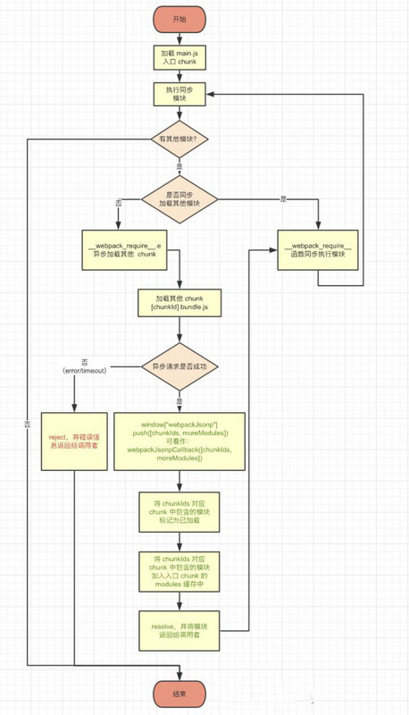

# webpack 打包产物代码分析

- [webpack 打包产物代码分析](https://hellogithub2014.github.io/2019/01/02/webpack-bundle-code-analysis/)
- [Webpack 是怎样运行的?](https://segmentfault.com/a/1190000019117897)
- [Webpack 打包含动态加载的类库](https://mp.weixin.qq.com/s?__biz=MjM5MTA1MjAxMQ==&mid=2651231515&idx=1&sn=55cd553fd9dcd5302916360a457eebe6&chksm=bd494c9f8a3ec589131ce8cef26fc7de36a1a49f2d0e89245ff864105abdb89229d92e58f26f)
- [Tobias Koppers：我当初为什么写webpack](https://mp.weixin.qq.com/s?__biz=MjM5MTA1MjAxMQ==&mid=2651228535&idx=1&sn=06d7aba782e719c2db719f749d13962a&chksm=bd4950f38a3ed9e5366fbf1944ffa4e70d68ef3e1654ae85537fd123f4c6a6f38f22097dbcac&scene=21#wechat_redirect)
- [剖析webpack模块化原理](https://segmentfault.com/a/1190000014389653)
- [webpack模块化原理-commonjs](https://segmentfault.com/a/1190000010349749)
- [unused harmony exports](https://github.com/lihongxun945/diving-into-webpack/blob/master/8-tree-shaking.md)

分析打包产物，调试打包结果。自己实现一遍打包输出所提供的工具函数功能

重点：

- 实现 exports 和 require
- 自动加载入口模块
- 控制缓存模块

Webpack 用自己的方式支持了 ES6 Module 规范

```js
// webpack 模块化通过自执行函数 IIFE 启动代码，把所有模块当做参数传入
// 然后使用 webpack 实现的 require 和 exports 实现模块化
// 对于代码分割，webpack自定义了一个函数以jsonp的方式加载js文件
(function (modules){
  // webpackBootstrap
  // ...
})({
  // 这里每一个模块函数都是被 webpack 封装处理的，为了实现模块化效果
  // 这里实现符合commonjs的规范 function(module, module.exports, require)
  "./src/main.js": (function(module, exports, require){
    // 模块主体
  }),
  "./src/utils.js": (function(module, exports, require){
    // 模块主体
  }),
});
```

具体实现参看 [webpackBootstrap](./code/1.webpackBootstrap.js)，仔细观察下 require 的实现，对 commonjs 以及 es 模块的处理

这里把 es模块中的 `export default`和`export` 都转换成了类似于commonjs的 `exports.xxx`，所有的`export`对象都是`__webpack_exports__`的属性




生成包默认会做 `Tree Shaking`

入口模块

```js

```

## 关于模块加载

### CommonJS

来源: https://www.imooc.com/article/250870

```js
(function(exports, require, module, __filename, __dirname) {
  // 模块的代码实际上在这里
  // module.exports = xxx
});
```

nodejs 执行时通过 NativeModule 执行 module 对象

```js
// 封装模块
NativeModule.wrap = function(script) {
  return NativeModule.wrapper[0] + script + NativeModule.wrapper[1];
};

NativeModule.wrapper = [
  '(function (exports, require, module, __filename, __dirname) { ',
  '\n});'
];
```

### AMD

在 webpack 中，AMD 的方式也可以实现异步加载，这和使用 require.js 的使用方式基本相同，在定义模块的时候需要按照 AMD 的规范来定义

```js
// 定义模块
define('modula-a', ['module-c'], function(c) {
  //
  return ...
})

// 依赖模块
require(["module-a", "module-b"], function(a, b) {
  console.log(a, b);
});

// AMD规范允许输出的模块兼容CommonJS规范
define(function(require, exports, module){
  console.log('module of main1:');
  var a = require('a')
  var b = require('b')

  // Return the module value
  module.exports = {
    say: function(){
      console.log('main1--hello');
    }
  };
});

// 使用

```


### UMD

```js
(function (window, factory) {
  // 先判断是否支持Node.js的模块（exports）是否存在
  if (typeof exports === 'object') {
    module.exports = factory();
    // 再判断是否支持AMD（define是否存在）
  } else if (typeof define === 'function' && define.amd) {
    define(factory);
  } else {
    window.eventUtil = factory();
  }
})(this, function () {
  // module ...
});
```
